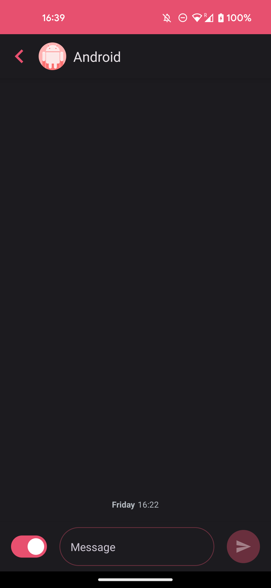
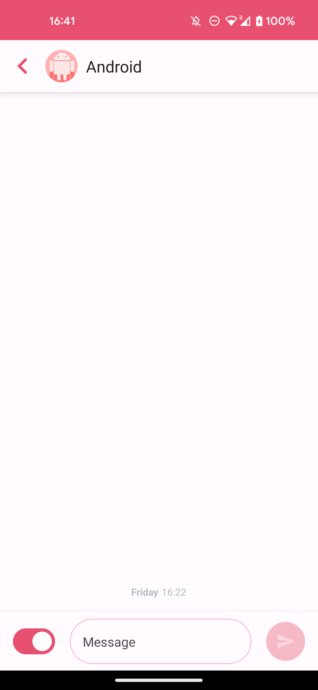
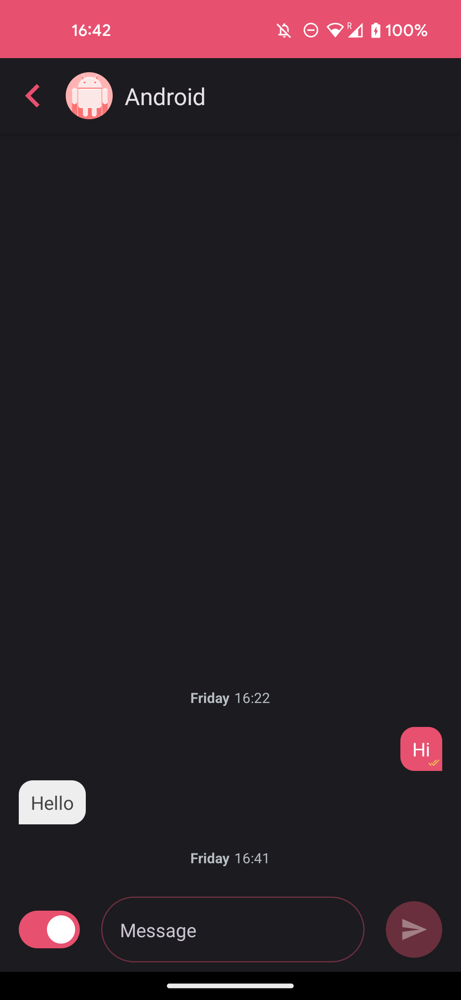
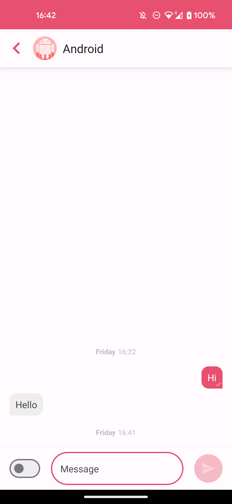
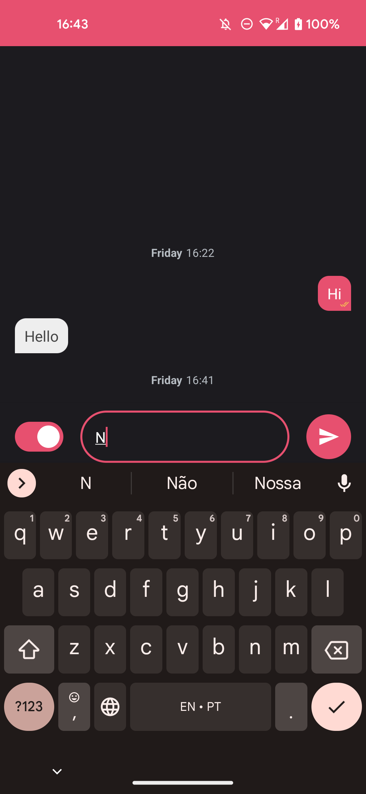

Compose Chat App
==================

This messaging application was built using the latest modern tools and frameworks.
It was built in `Kotlin`, the official language for Android.
It is a single screen to simulate a conversation between two mocked users, the sender and the receiver.

All the UI components were implemented with `Compose`.

## Architecture

The chosen design pattern for this app was `MVVM`, following the [official architecture guidance](https://developer.android.com/topic/architecture) from Google.

- It is a `single activity` loading an compose app content from the start.
- It contains a `Repository` class to manage the `data` of the app.
- As it is a simple app, the layers were split by packages, not modules.
- All conversation data is persisted on the database.
- There is no connectivity with the internet, everything was implemented in an `offline mode`.
- Compose provides `Material` components out-of-the-box, and it was used thoroughly the application.
- The screen (ComposeChatApp) makes use of a `Scaffold`, a prebuilt component that provides slots for top and bottom bars, so the screen was split in 3 parts:
    - `topBar`: named ChatTopAppBar, for the bar showing the back button, profile picture and user name.
    - `bottomBar`: named MessageBottomBar, for the area where the user can send the messages and switch between sender and receiver.
    - `content`: named ChatSection, where the conversation is shown.
- A shadow was added to separate the 3 slots.
- `Unit tests` were created to test the `business logic` of the app

## Screenshots

 

 

# MessageBottomBar
- Both text field and Send button have an alpha applied when they are `disabled/unfocused`.
- The Send button is enabled only when at least a single character is added to the text field
- The Message field has a `label placeholder` and it has its alpha changed once is focused
- The switch button was added to simulate the "other" user, and has its colour changed accordingly
- Once a message is typed and sent, a new Message is added to the `Room database`

# ChatSection
- The Chat section shows an ongoing conversation.
- The conversation is persisted on a `Room database`
- It observes to the database and reacts to any changes, so for every new message sent, the UI will be updated.
To test this functionality, go to `App Inspection`, select the `com.varani.composechat` process, `chat_database`, `message` table, `Open new query tab` and run the following query:
       
       INSERT INTO message VALUES(10, 1, "SENDER", "Message added to the database", "2023-05-12T10:34")
       
- That is possible due to the use of a `Flow`
- The conversation is aligned to the bottom of the section and new messages go to the bottom, keeping the oldest at the top
- The `tail`, color and alignment of the bubbles were preset on a Message sealed class. They can be:
    - `Sender`: aligned to the right, magenta color and tail on the bottom right
    - `Receiver`: aligned to the left, gray color and tail on the bottom left
    - `SectionLabel`: aligned to the center, transparent background and no tails
- The tail was achieved by rounding 3 corners of a Surface shape, keeping only the bottom right for senders and bottom left for receivers
- A `sectioning label` is added 10 seconds later of the last message timestamp.
    - Format pattern used: `"EEEE H:mm"`
    - Before showing the label on the screen, the string is converted to an `AnnotatedString` to format it with a span:
        - Day of the week: bold, 12sp
        - Time: normal, 12sp, with format hh:mm
    - It was chosen `10 seconds` for testing purposes, but it can be updated to `1 hour (3600000)` on the `startTimerForLabelSectioning()` function of the ViewModel
    - Once a new message is sent, a `coroutine` is launched with a delay of 10 seconds.
        - The `coroutine` job is cancelled if a new message arrives
        - A section label is added once 10 seconds has passed with no new messages from the user
- To clean the chat, go to `App info` > `Clear storage`

## Next steps/nice to have

- [ ] As it is a simple app, `Paging library` from `Jetpack` wasn't used, but given a long long conversation, it would be nice to implement it to load chunks of message history at a time;
- [ ] Integrate `AI` to be the "receiver" and remove the need of a switch to switch between users;
- [ ] A second screen to create new chats with other people would be nice, loading different conversations;
- [ ] Remove the hardcoded *chatId* from the ViewModel and get it dinamically according to the chat selected;
- [ ] Make components more reusable, adding parameters to load profile picture and name, for example;
